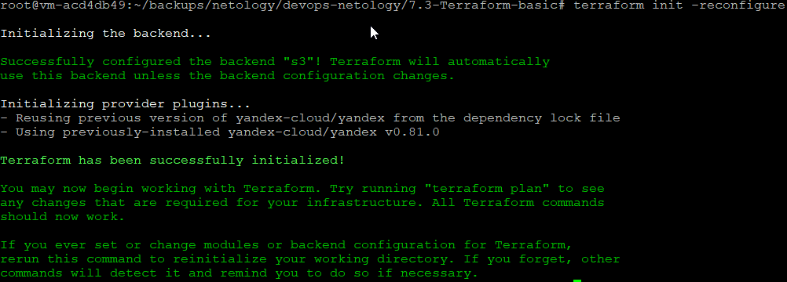
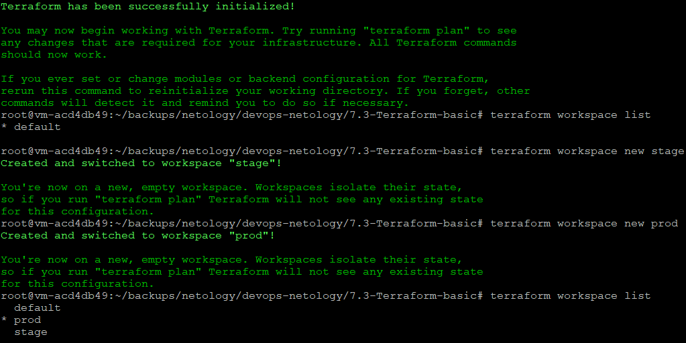
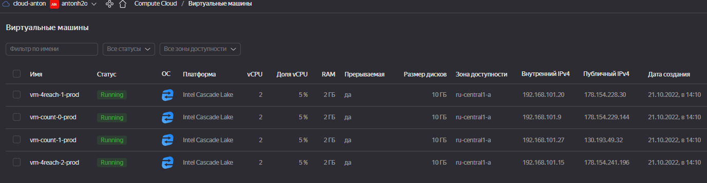
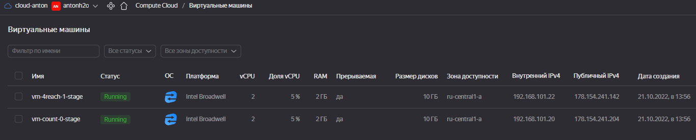

# Домашнее задание к занятию "7.3. Основы и принцип работы Терраформ"

## Задача 1. Создадим бэкэнд в S3 (необязательно, но крайне желательно).

Если в рамках предыдущего задания у вас уже есть аккаунт AWS, то давайте продолжим знакомство со взаимодействием
терраформа и aws. 

1. Создайте s3 бакет, iam роль и пользователя от которого будет работать терраформ. Можно создать отдельного пользователя,
а можно использовать созданного в рамках предыдущего задания, просто добавьте ему необходимы права, как описано 
[здесь](https://www.terraform.io/docs/backends/types/s3.html).
1. Зарегистрируйте бэкэнд в терраформ проекте как описано по ссылке выше. 
```
В Yandex cloud создан бэкэнд в S3
файл backend.tf
```
[backend.tf](backend.tf)

## Задача 2. Инициализируем проект и создаем воркспейсы. 

1. Выполните `terraform init`:
    * если был создан бэкэнд в S3, то терраформ создат файл стейтов в S3 и запись в таблице 
dynamodb.
    * иначе будет создан локальный файл со стейтами.  

```
Выполнил terraform init -reconfigure
```


1. Создайте два воркспейса `stage` и `prod`.

```
terraform workspace list
  default
  prod
* stage
```



1. В уже созданный `aws_instance` добавьте зависимость типа инстанса от вокспейса, что бы в разных ворскспейсах 
использовались разные `instance_type`.

```
В Yandex Cloud можно использовать platform_id. Добавил в определение ресурса строчку:

platform_id = "${terraform.workspace == "stage" ? "standard-v1" : terraform.workspace == "prod" ? "standard-v2" : "standard-v1" }"

```


1. Добавим `count`. Для `stage` должен создаться один экземпляр `ec2`, а для `prod` два. 

```
файл main4count.tf

```

1. Создайте рядом еще один `aws_instance`, но теперь определите их количество при помощи `for_each`, а не `count`.

```
файл main5for_reach.tf

```

Разворачивание в workspace prod:


Разворачивание в workspace stage:



1. Что бы при изменении типа инстанса не возникло ситуации, когда не будет ни одного инстанса добавьте параметр
жизненного цикла `create_before_destroy = true` в один из рессурсов `aws_instance`.

```
добавил в ресурсе main5for_reach.tf:

lifecycle {
    create_before_destroy = true
  }
```

1. При желании поэкспериментируйте с другими параметрами и рессурсами.

В виде результата работы пришлите:
* Вывод команды `terraform workspace list`.

```
terraform workspace list
  default
  prod
* stage

```
* Вывод команды `terraform plan` для воркспейса `prod`.  

```
Вывод команды `terraform plan` сохранил в файле 
terraform_plan_prod.txt

```
[terraform_plan_prod.txt](https://github.com/antonh2o/devops-netology/blob/main/7.3-Terraform-basic/tf_plan_prod.txt "Ссылка на файл terraform_plan_prod.txt")

---

### Как cдавать задание

Выполненное домашнее задание пришлите ссылкой на .md-файл в вашем репозитории.

---
