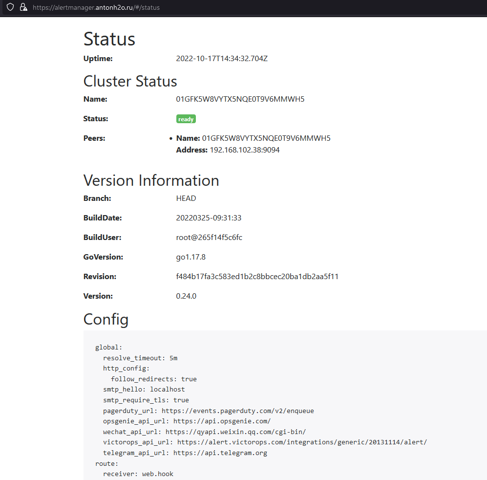

Дипломное задание по курсу «DevOps-инженер»

# Дипломный практикум в YandexCloud


### 1. Зарегистрировать доменное имя (любое на ваш выбор в любой доменной зоне).

```
зарегистрирован домен antonh2o.ru
Делегировал на NS сервера Яндекс Облака

```


### 2. Подготовить инфраструктуру с помощью Terraform на базе облачного провайдера YandexCloud.
1. Создайте сервисный аккаунт, который будет в дальнейшем использоваться Terraform для работы с инфраструктурой с необходимыми и достаточными правами. Не стоит использовать права суперпользователя


2. Подготовьте backend для Terraform:

```
terraform {
required_providers {
    yandex = {
      source = "yandex-cloud/yandex"
    }
  }
  backend "s3" {
    bucket     = "antonh2obackend"
    endpoint   = "storage.yandexcloud.net"
    region     = "ru-central1"
    key        = "terraform.tfstate"
    access_key = "YC.....UH"
    secret_key = "YC.....oP_vy.....sA"

    shared_credentials_file = "~/.aws/config"
    profile    =  "netology"

    skip_region_validation      = true
    skip_credentials_validation = true
  }
}
```


а. Рекомендуемый вариант: создайте два workspace: stage и prod. В случае выбора этого варианта все последующие шаги должны учитывать факт существования нескольких workspace.
б. Альтернативный вариант: используйте один workspace, назвав его stage. Пожалуйста, не используйте workspace, создаваемый Terraform-ом по-умолчанию (default).

```
Выбран вариант с одним workspace stage

terraform workspace new stage

```

```
Инфраструктура подготовлена
из папки terraform
запускается tf_apply.sh
уничтожается tf_destroy.sh

├── ansible.tf       - Манифест установок ролей на созданных виртуальных машинах
├── backend.tf    - Bucket
├── dns.tf    - Настройки DNS зоны и записей
├── gitlab-runner.tf - Настройки виртальных машин Gitlad Gitlab-runner
├── inventory.tf     - Настройки виртальных машин
├── main.tf          - Настройки виртальной машины Reverse proxy nginx
├── monitoring.tf    - Настройки виртальной машины стека моиторинга
├── mysql.tf         - Настройки виртальных машин кластера mysql
├── network.tf    - Настройки сети
├── output.tf     - Настройки выходных переменных
├── provider.tf   - Настройки провайдера YandexCloud
├── tf_apply.sh     - Скрипт инициализации поанирования и разворачивания
├── tf_destroy.sh  - Скипт уничтожения
├── tf_restart.sh  - Скрипт пересоздания
├── variables.tf  - Описание переменных и значениями по дефолту
└── wordpress.tf  - Настройки виртальной машины nginx с установленным приложением wordpress

```

Общая картина в Яндекс Облаке


Создание виртуальных машин с помощью Terraform


Создание записей DNS с помощью Terraform dns.tf:


Создание сети с помощью Terraform network.tf:


### 3. Установка Nginx и LetsEncrypt
Необходимо разработать Ansible роль для установки Nginx и LetsEncrypt.
Рекомендации:
• Имя сервера: you.domain
• Характеристики: 2vCPU, 2 RAM, External address (Public) и Internal address.
Цель:
Создать reverse proxy с поддержкой TLS для обеспечения безопасного доступа к веб-сервисам по HTTPS.
Ожидаемые результаты:
В вашей доменной зоне настроены все A-записи на внешний адрес этого сервера:
https://www.you.domain (WordPress)
https://gitlab.you.domain (Gitlab)
https://grafana.you.domain (Grafana)
https://prometheus.you.domain (Prometheus)
https://alertmanager.you.domain (Alert Manager)
Настроены все upstream для выше указанных URL, куда они сейчас ведут на этом шаге не важно, позже вы их отредактируете и укажите верные значения.
В браузере можно открыть любой из этих URL и увидеть ответ сервера (502 Bad Gateway). На текущем этапе выполнение задания это нормально!

```
Reverse proxy на основе Nginx и LetsEncrypt разворачивается с помощью Ansible роли proxy_server
прописываются апстримы
Роль поднимается в последнюю очередь, после поднятия всех подготовленных ролей чтобы не получать 502 ошибку

```


### 4. Установка кластера MySQL
Необходимо разработать Ansible роль для установки кластера MySQL.
Рекомендации:
• Имена серверов: db01.you.domain и db02.you.domain
• Характеристики: 4vCPU, 4 RAM, Internal address.
Цель:
Получить отказоустойчивый кластер баз данных MySQL.
Ожидаемые результаты:
1. MySQL работает в режиме репликации Master/Slave.
2. В кластере автоматически создаётся база данных с именем wordpress.
3. В кластере автоматически создаётся пользователь wordpress с полными правами на базу wordpress и паролем wordpress.

```
Ansible роль mysql-cluster:
Разворачивается кластер mysql
устанавливается mysql
    - mysql-client
    - python3-mysqldb
    - libmysqlclient-dev
    - mysql-server
настраиваются репликация мастер слейв
```

проверка репликации:
```
mysql> SHOW REPLICA STATUS\G;
*************************** 1. row ***************************
             Replica_IO_State: Waiting for source to send event
                  Source_Host: db01.ru-central1.internal
                  Source_User: replication
                  Source_Port: 3306
                Connect_Retry: 60
              Source_Log_File: binlog.000004
          Read_Source_Log_Pos: 547666
               Relay_Log_File: db02-relay-bin.000002
                Relay_Log_Pos: 545466
        Relay_Source_Log_File: binlog.000004
           Replica_IO_Running: Yes
          Replica_SQL_Running: Yes
              Replicate_Do_DB: 
          Replicate_Ignore_DB: 
           Replicate_Do_Table: 
       Replicate_Ignore_Table: 
      Replicate_Wild_Do_Table: 
  Replicate_Wild_Ignore_Table: 
                   Last_Errno: 0
                   Last_Error: 
                 Skip_Counter: 0
          Exec_Source_Log_Pos: 547666
              Relay_Log_Space: 545675
              Until_Condition: None
               Until_Log_File: 
                Until_Log_Pos: 0
           Source_SSL_Allowed: No
           Source_SSL_CA_File: 
           Source_SSL_CA_Path: 
              Source_SSL_Cert: 
            Source_SSL_Cipher: 
               Source_SSL_Key: 
        Seconds_Behind_Source: 0
Source_SSL_Verify_Server_Cert: No
                Last_IO_Errno: 0
                Last_IO_Error: 
               Last_SQL_Errno: 0
               Last_SQL_Error: 
  Replicate_Ignore_Server_Ids: 
             Source_Server_Id: 1
                  Source_UUID: 36ce16dc-4eff-11ed-ad7f-d00d12313c7e
             Source_Info_File: mysql.slave_master_info
                    SQL_Delay: 0
          SQL_Remaining_Delay: NULL
    Replica_SQL_Running_State: Replica has read all relay log; waiting for more updates
           Source_Retry_Count: 86400
                  Source_Bind: 
      Last_IO_Error_Timestamp: 
     Last_SQL_Error_Timestamp: 
               Source_SSL_Crl: 
           Source_SSL_Crlpath: 
           Retrieved_Gtid_Set: 
            Executed_Gtid_Set: 
                Auto_Position: 0
         Replicate_Rewrite_DB: 
                 Channel_Name: 
           Source_TLS_Version: 
       Source_public_key_path: 
        Get_Source_public_key: 0
            Network_Namespace: 
1 row in set (0.00 sec)


после роли mysql-cluster на сервера mysql устанавливается mysqld-exporter
```


### 5. Установка WordPress
Необходимо разработать Ansible роль для установки WordPress.
Рекомендации:
• Имя сервера: app.you.domain
• Характеристики: 4vCPU, 4 RAM, Internal address.
Цель:
 Установить WordPress. Это система управления содержимым сайта (CMS) с открытым исходным кодом.

Ожидаемые результаты:
1. Виртуальная машина на которой установлен WordPress и Nginx/Apache (на ваше усмотрение).
2. В вашей доменной зоне настроена A-запись на внешний адрес reverse proxy:
https://www.you.domain (WordPress)
3. На сервере you.domain отредактирован upstream для выше указанного URL и он смотрит на виртуальную машину на которой установлен WordPress.
4. В браузере можно открыть URL https://www.you.domain и увидеть главную страницу WordPress.

```
Ansible роль wordpress:
- Устанавливается nginx
- Устанавливается 'php7.4','php7.4-fpm', 'php7.4-cli', 'php7.4-mysql','php7.4-gd
- Устанавливается приложение Wordpress
- Устанавливается wp-cli
- С помощью wp-cli настраивается domain, admin, password, title
устанавливается plugin wp-statistics

```


### 6. Установка Gitlab CE и Gitlab Runner
Необходимо настроить CI/CD систему для автоматического развертывания приложения при изменении кода.
Рекомендации:
• Имена серверов: gitlab.you.domain и runner.you.domain
• Характеристики: 4vCPU, 4 RAM, Internal address.
Цель:
Построить pipeline доставки кода в среду эксплуатации, то есть настроить автоматический деплой на сервер app.you.domain при коммите в репозиторий с WordPress.
Подробнее о Gitlab CI
Ожидаемый результат:
1. Интерфейс Gitlab доступен по https.
2. В вашей доменной зоне настроена A-запись на внешний адрес reverse proxy:
https://gitlab.you.domain (Gitlab)
3. На сервере you.domain отредактирован upstream для выше указанного URL и он смотрит на виртуальную машину на которой установлен Gitlab.

```
на виртуальные машины
gitlab разворачиваются роль gitlab и сбрасывается у пользователя root пароль на wordpress
runner разворачиваются роль runner как shell runner регистрируется по токену на gitlab

```
4. При любом коммите в репозиторий с WordPress и создании тега (например, v1.0.0) происходит деплой на виртуальную машину.

```
Реализовано с помощью .gitlab-ci.yml

stages:
  - build_and_deploy
deploy-job:
  stage: build_and_deploy
  script:
    - echo "Deploy"
    #- sudo ssh-keygen -f "/root/.ssh/known_hosts" -R "antonh2o.ru"
    - ssh -o StrictHostKeyChecking=no ubuntu@192.168.102.20 "mkdir -p /tmp/wordpress"
    - echo "Clone repo"
    - ssh -o StrictHostKeyChecking=no ubuntu@192.168.102.20 "git clone http://gitlab.antonh2o.ru/root/wordpress.git /tmp/wordpress/"
    - echo "Update on wordpress server"
    - ssh -o StrictHostKeyChecking=no ubuntu@192.168.102.20 "sudo mv /var/www/www.antonh2o.ru/wordpress /tmp/wordpress.bak"
    - ssh -o StrictHostKeyChecking=no ubuntu@192.168.102.20 "sudo mv /tmp/wordpress /var/www/www.antonh2o.ru/"
    - ssh -o StrictHostKeyChecking=no ubuntu@192.168.102.20 "sudo rm -rf /var/www/www.antonh2o.ru/wordpress/.git"
    - echo "Set files permissions"
    - ssh -o StrictHostKeyChecking=no ubuntu@192.168.102.20 "sudo chown -R www-data:www-data /var/www/www.antonh2o.ru/wordpress/".
    - ssh -o StrictHostKeyChecking=no ubuntu@192.168.102.20 "sudo systemctl start nginx"
```

Создаем файл с содержанием test update
Автоматически запускается Автоматическое развертывание


проверяем на сайте, появился ли файл update.txt


### 7. Установка Prometheus, Alert Manager, Node Exporter и Grafana
Необходимо разработать Ansible роль для установки Prometheus, Alert Manager и Grafana.
Рекомендации:
• Имя сервера: monitoring.you.domain
• Характеристики: 4vCPU, 4 RAM, Internal address.
Цель:
Получение метрик со всей инфраструктуры.
Ожидаемые результаты:
1. Интерфейсы Prometheus, Alert Manager и Grafana доступены по https.

Прометеус


2. В вашей доменной зоне настроены A-записи на внешний адрес reverse proxy:
• https://grafana.you.domain (Grafana)
• https://prometheus.you.domain (Prometheus)
• https://alertmanager.you.domain (Alert Manager)

3. На сервере you.domain отредактированы upstreams для вышеуказанных URL и они смотрят на виртуальную машину на которой установлены Prometheus, Alert Manager и Grafana.
4. На всех серверах установлен Node Exporter и его метрики доступны Prometheus.
5. У Alert Manager есть необходимый набор правил для создания алертов.

Алертменеджер

Для проверки алертинга выключим сервер реплики mysql, получаем 2 алерта


После обратного включения еще алерт mysql restarted


6. В Grafana есть дашборд отображающий метрики из Node Exporter по всем серверам.
7. В Grafana есть дашборд отображающий метрики из MySQL (*).
8. В Grafana есть дашборд отображающий метрики из WordPress (*).

Графана Дашборды


```
С помощью Ansible роли node_exporter устанавливается Ноде_експортер на все виртуальные машины

Виртуальная машина monitoring настраивается:
С помощью Ansible роли prometheus разворачивается и настраивается:
Prometheus с настроенными таргетами:
  node_exporter на порту 9100 на всех виртуальных машинах
  mysqld-exporter на кластере mysql
Alertmanager с настроеммными alert_rules

С помощью Ansible роли grafana разворачивается и настраивается:
Grafana устанавливается и копируются преднастроенные:
  Dashboards
 - Node_Exporter_Full
 - Mysql_Overview
 - Mysql_REplication
 - Wordpress_Statistics
  Datasources
  - prometheus по умолчанию
  - mysql под именем wordpress
```


Что необходимо для сдачи задания?
Репозиторий со всеми Terraform манифестами и готовность продемонстрировать создание всех ресурсов с нуля.
Репозиторий со всеми Ansible ролями и готовность продемонстрировать установку всех сервисов с нуля.
Скриншоты веб-интерфейсов всех сервисов работающих по HTTPS на вашем доменном имени.
https://www.you.domain (WordPress)
https://gitlab.you.domain (Gitlab)
https://grafana.you.domain (Grafana)
https://prometheus.you.domain (Prometheus)
https://alertmanager.you.domain (Alert Manager)
Все репозитории рекомендуется хранить на одном из ресурсов (github.com или gitlab.com).


Для выпуска сертификатов использовали STAGE сервера Letsencrypt


